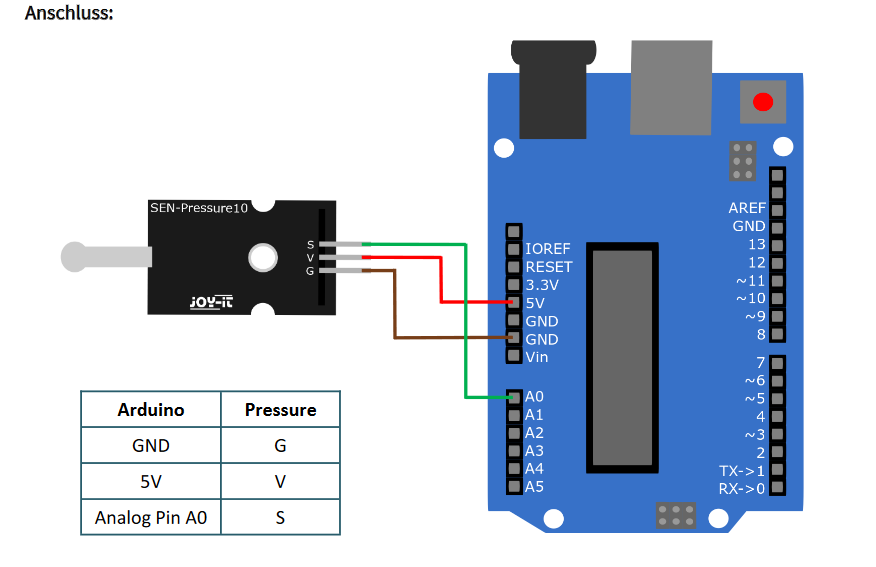
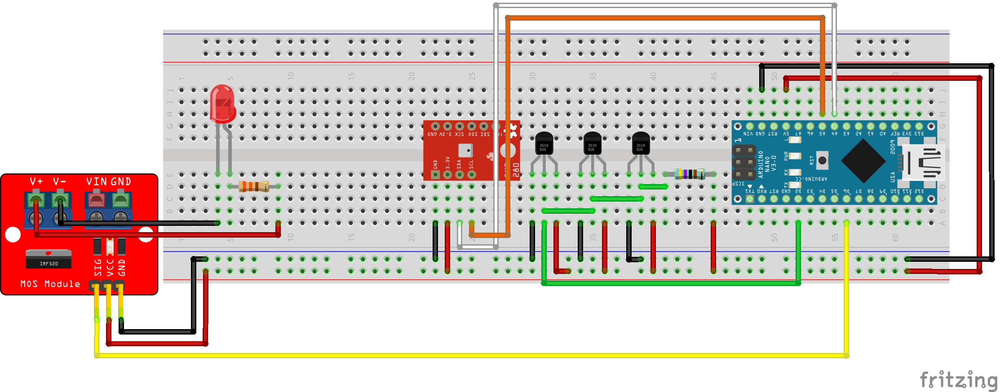
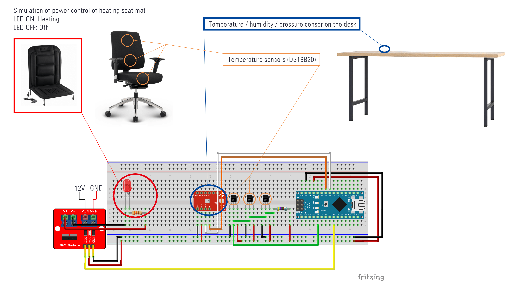

# arduino project anwendungswerkstatt

## 1 Diagram

### 1.1 Circuit diagram

#### 1.1.1 Arduino Nano + 3 Dallas temperature sensor + bme280 sensor + LED (for test purposes)

#### 1.1.2 pressure sensor

#### 1.1.3 Arduino MKR 1010 (incl. ESP32) + bme280 sensor

see bme280 part in 1.1.1

#### 1.1.4 Arduino Nano + 3 Dallas temperature sensor + bme280 sensor + MOSFET 

### 1.2 Sketch

## 2. python code

### 2.1 function to get data from Arduino via WiFi

in this version, used matplotlib + drawnow libraries to create 
live plot automatically

#### 2.1.1 for Jupyter Notebook users:
[get_data.ipynb](/Python/get_data.ipynb)

#### 2.1.2 for other python IDE users:
[get_data.py](/Python/get_data.py)

### 2.2 GUI

in this version, used pyqtgraph to create live plot and PyQt5 to create
GUI

[datenlogger.py](/Python/datenlogger.py)

Environmental:

#### 2.2.1 UI

[gui.ui](/Python/gui.ui)

used QtDesigner to build GUI

[gui.py](/Python/gui.py)

used PyUIC5 to convert .ui in .py

## 3. Arduino code:

### 3.1 Test

[Arduino_nano_dallas_and_bme280_sensor.ino](/Arduino/archiv/Arduino_nano_dallas_and_bme280_sensor/Arduino_nano_dallas_and_bme280_sensor.ino)

Circuit diagram --> **1.1**

### 3.2 Datenlogger via WiFi

[Arduino_nano_mkr_wifi_1010_V2.ino](/Arduino/archiv/Arduino_mkr_wifi_1010_V2/Arduino_mkr_wifi_1010_V2.ino)

Circuit diagram --> **1.3**

### 3.3 MOSFET control

[Arduino_nano_dallas_and_bme280_sensor_with_mosfet.ino](/Arduino/archiv/Arduino_nano_dallas_and_bme280_sensor_with_mosfet/Arduino_nano_dallas_and_bme280_sensor_with_mosfet.ino)

## 4. list of hardware:

Arduino MKR 1010 (with ESP32 module) { **plan B** } --> should be 
replaced by Arduino Nano (ATmega328P) + ESP8266 module{ **plan A** }

BME280 sensor (temperature/pressure/humidity)

Dallas temperature sensor DS18B20

## 5. Demo:
### 5.1 Datenlogger (jupyter notebook + matplotlib)

