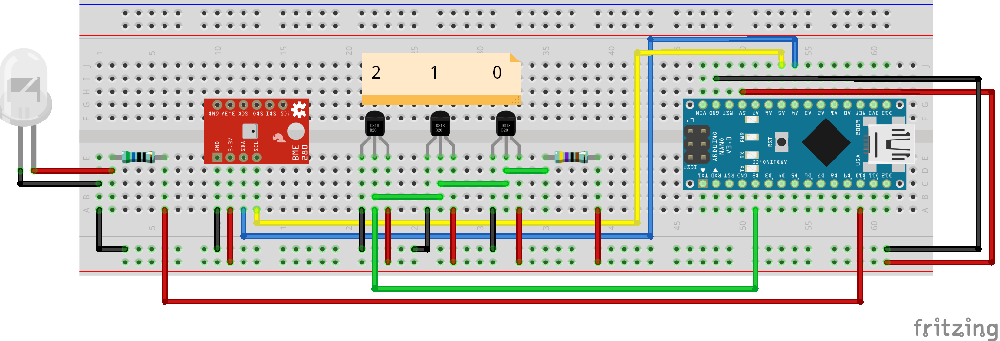
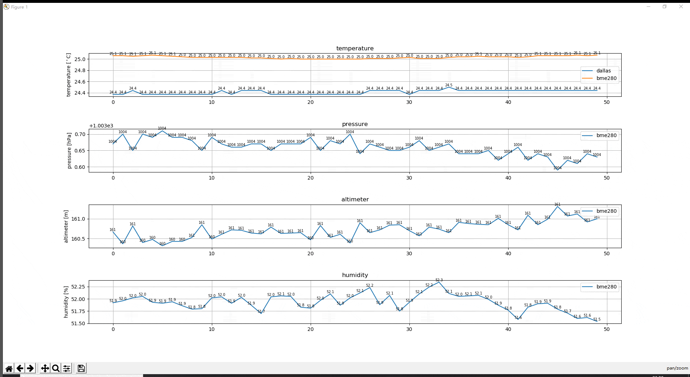

# arduino project anwendungswerkstatt

### for Jupyter Notebook users:
[get_data.ipynb](/get_data.ipynb)

### for other python IDE users (for example Spyder):
[get_data.py](get_data.py)

### Arduino Code:
[Arduino_nano_dallas_and_bme280_sensor.ino](/Arduino_nano_dallas_and_bme280_sensor/Arduino_nano_dallas_and_bme280_sensor.ino)

## Arduino + Python
using matplotlib + drawnow libraries to create live plot automatically

## list of hardware:
Arduino Nano (ATmega328P)

Dallas temperature sensor

BME280 sensor (temperature/pressure/altimeter/humidity)

Demo:

