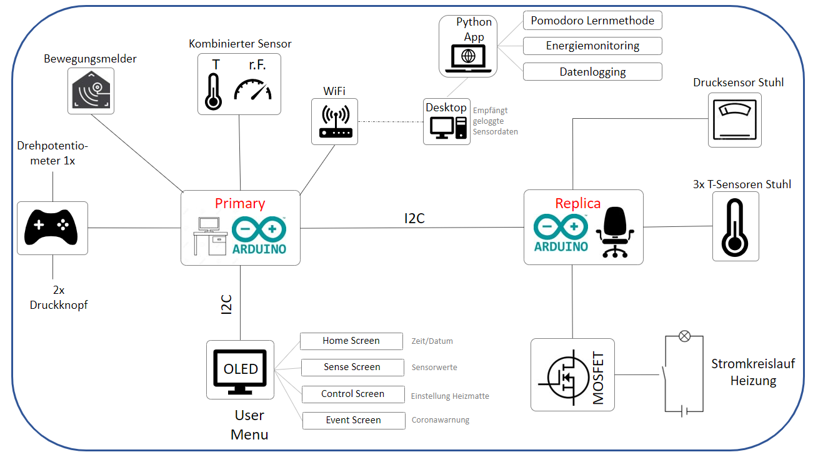

# Anwendungswerkstatt project climate chair 

## Table of contents
1. [Diagram](#diagram)
    
    1.1 [Draft](#draft)
   
    1.2 [Circuit diagram](#circuit-diagram)

    1.3 [Sketch](#sketch)

2. [Python code](#python-code)

    2.1 [get data](#get-data)

    2.2 [GUI](#gui)

3. [Arduino code](#arduino-code)

    3.1 [Arduino desk (Primary)](#primary)

    3.2 [Arduino chair (Replica)](#replica)
   
4. [List of hardware](#hardware)

5. [Demo](#demo)

## 1 Diagram 

### 1.1 Draft 

### 1.2 Circuit diagram 

#### 1.2.1 Arduino Desk (Primary) {Arduino MKR WiFi 1010}

#### 1.2.2 Arduino Chair (Replica) {Arduino Nano ATmega328P (Old Bootloader)}

### 1.3 Sketch 

## 2. python code 

[desktop_file.py](/Python/desktop_file.py)

settings:

[desktop.ini](/Python/desktop.ini)

Environmental:

## 3. Arduino code: 

### 3.1 Arduino Desk (Primary) {Arduino MKR WiFi 1010} 

[Arduino_Desk_Primary_mkr_wifi_1010.ino](/Arduino/Arduino_Desk_Primary_mkr_wifi_1010/Arduino_Desk_Primary_mkr_wifi_1010.ino)

Change WiFi username & password in:

[arduino_secrets.h](/Arduino/Arduino_Desk_Primary_mkr_wifi_1010/arduino_secrets.h)

Circuit diagram --> **1.2.1**

### 3.2 Arduino Chair (Replica) {Arduino Nano ATmega328P (Old Bootloader)} 

[Arduino_Chair_Replica_Nano.ino](/Arduino/Arduino_Chair_Replica_Nano/Arduino_Chair_Replica_Nano.ino)

Circuit diagram --> **1.2.2**

## 4. list of hardware: 

| components      | name | description | Library / Software |
| ----------- | ----------- | ----------- | ----------- |
| microcontroller | Arduino Nano | ATmega 328P (old bootloader), Arduino chair. Controls sensors and actuators. | Arduino IDE |
| microcontroller with WiFi | Arduino MKR WiFi 1010 | Controls sensors and actuators. Opens servers and sends data via WiFi | Arduino IDE, WiFiNINA.h(Library), SPI.h (Library)  |
| real Time Clock | integrated in Arduino MKR WiFi 1010 | Time measurement, time update via WiFi | RTCZero.h (Library) |
| temperature and humidity sensor | DHT 11 | Measures temperature and humidity, transmits data digitally | DHT.h (Library) |
| motion sensor | HC-SR501 | passive infrared sensor | - |
| 2x button | - | An electrical connection is established by pressing a button | - |
| rotary potentiometer | - | Allows manual setting of a resistance in 1024 levels | - |
| OLED display  | SSD1306  | Display with 128 x 64 pixels, to be operated via I2C bus | Adafruit_SSD1306.h, Wire.h, Adafruit_GFX.h(Libraries)  |
| 2x Breadboard | - | - | - |
| 3x temperatur sensors | DS18B20 | A 4.7k resistor is required, see circuit diagram | OneWire.h (Library), DallasTemperature.h (Library) |
| pressure sensor | ARD SEN-PRESSURE10 | - | - |
| MOSFET | Grove MOSFET CJQ4435 | - | - |
| Heating mat | Car seat heating pad with 2 levels (12 V) | - | - |

